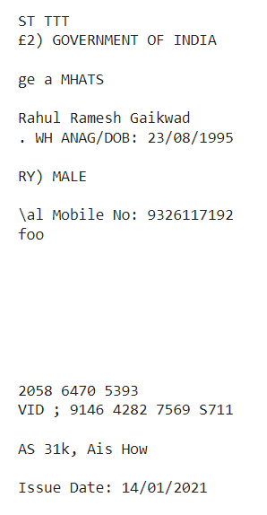
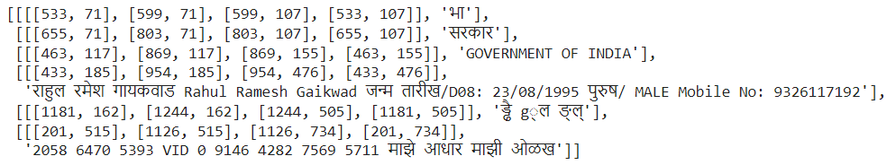
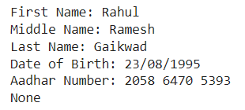
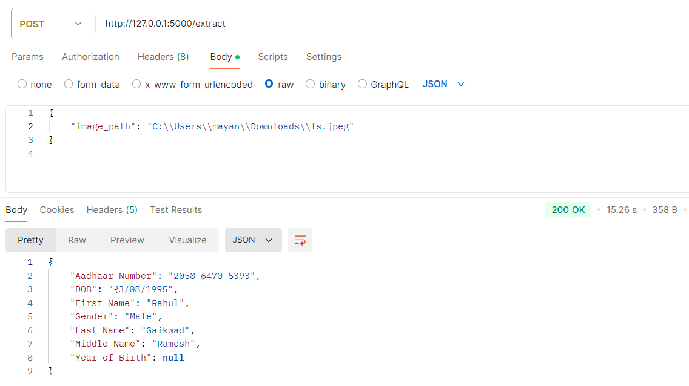

# **Aadhaar Information Extraction Project**

### 🎯 **Goal**

The project aims to automate the extraction of relevant Aadhaar card information using Optical Character Recognition (OCR) techniques. The extracted details include:
- First Name
- Middle Name
- Last Name
- Gender
- Date of Birth (DOB)
- Aadhaar Number

### 🧵 **Dataset**

- No specific dataset is provided as input images will be Aadhaar card images uploaded by the user.

### 🧾 **Description**

This project implements two approaches for extracting Aadhaar card information:
1. **Tesseract OCR with Pre-processing**: Text extraction from greyscale images using Tesseract and post-processing via regular expressions.
2. **EasyOCR with Multi-language Support**: Leveraging EasyOCR’s Hindi and English language support for more accurate text extraction.

### 🧮 **What I have done!**

1. Pre-processed the Aadhaar card images by converting them to greyscale.
2. Implemented text extraction using Tesseract and EasyOCR.
3. Processed the extracted text using regular expressions to retrieve critical Aadhaar details:
   - First Name
   - Middle Name
   - Last Name
   - Gender
   - Date of Birth (DOB)
   - Aadhaar Number (in `XXXX XXXX XXXX` format)

### 🚀 **Models Implemented**

1. **Tesseract OCR**: Utilized for extracting text after image pre-processing.
2. **EasyOCR**: Used for multi-language OCR (Hindi and English) to overcome limitations of Tesseract.

- **Why these models?**  
  - Tesseract is a commonly used open-source OCR tool, but its performance drops with complex fonts and mixed-language documents like Aadhaar cards.
  - EasyOCR supports multiple languages and handles complex document structures better than Tesseract.

### 📚 **Libraries Needed**

- Tesseract OCR
- EasyOCR
- OpenCV (`cv2`) for image pre-processing
- Regular expressions (`re`) for text processing
- Python Imaging Library (Pillow)

### 📊 **Exploratory Data Analysis Results**

This section highlights the result comparison of the Aadhaar information extraction using both **Tesseract OCR** and **EasyOCR** approaches. Screenshots are provided to demonstrate the results and a comparative analysis of performance.

---

## **Result Comparison: Aadhaar Information Extraction**

### 1. Tesseract OCR Approach

In this approach, the Aadhaar card image is first converted to greyscale and then passed through the Tesseract OCR engine. Regular expressions (`re`) are used to extract key information such as names, gender, date of birth, and Aadhaar number from the extracted text.

#### Screenshot for Tesseract OCR Result:

#### Challenges:
- **Accuracy**: Tesseract struggles with mixed-language documents (English + Hindi).
- **Pre-processing Required**: The image needs to be pre-processed (converted to greyscale) to improve text extraction.
- **Hindi Text**: Tesseract doesn't handle Hindi text well, which reduces its accuracy for Aadhaar cards that include Hindi.

---

### 2. EasyOCR Approach

The EasyOCR approach uses multi-language support for both Hindi and English, making it a better fit for Aadhaar card text recognition. The extracted text is processed using regular expressions to find relevant details.

#### Output for EasyOCR:
- **First Name**: `Rahul`
- **Middle Name**: `Ramesh`
- **Last Name**: `Gaikwad`
- **Gender**: `Male`
- **DOB**: `23/08/1995`
- **Aadhaar Number**: `2058 6470 5393`

#### Screenshot for EasyOCR Result:

#### Screenshot after Extraction:

#### Advantages:
- **Higher Accuracy**: EasyOCR performs significantly better with mixed-language documents, making it ideal for Aadhaar cards.
- **Multi-language Support**: Supports both English and Hindi, improving text extraction accuracy.
- **No Heavy Pre-processing**: Works well without needing extensive image manipulation.

---

### **Comparison of Results**

| Feature              | Tesseract OCR                      | EasyOCR                          |
|----------------------|------------------------------------|----------------------------------|
| **Languages**         | English only                      | English and Hindi support        |
| **Accuracy**          | Low to Medium                     | High                             |
| **Pre-processing**    | Requires greyscale conversion     | Minimal pre-processing needed    |
| **Performance**       | Faster but less accurate          | Bit slower but more accurate     |
| **Aadhaar Extraction**| Struggles with Hindi and complex fonts | Handles both languages well    |

---

## **API Result Screenshot**

Here is the expected result returned from the API after extracting information from the Aadhaar card image:

### **Input Body (JSON):**
`
{
  "image_path": "C:\\Users\\mayan\\Downloads\\fs.jpeg"
}
`

### 📈 **Performance of the Models based on the Accuracy Scores**

EasyOCR is more accurate than Tesseract. THough no accuracy testing has been done on large scale due to lack of dataset

### 📢 **Conclusion**

- The EasyOCR approach shows higher accuracy due to its ability to process both Hindi and English text on Aadhaar cards. Minimal pre-processing is required compared to Tesseract.
- Based on the accuracy results, EasyOCR is the preferred model for extracting Aadhaar card information.

### ✒️ **Your Signature**

*Mayank Chougale*  
[GitHub](https://github.com/Mayank202004) | [LinkedIn](https://www.linkedin.com/in/mayank-chougale-4b12b4262/)
