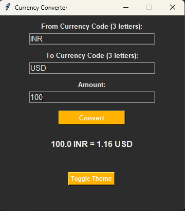

# 💱 Currency Converter GUI (Python + Tkinter)

A simple, elegant desktop application that converts currencies using real-time exchange rates. Built with Python and Tkinter, and includes light/dark theme toggle support! 🌗

---

## 📚 Table of Contents

- [🚀 Features](#-features)
- [🖼️ App Preview](#️-app-preview)
- [⚙️ How to Run](#️-how-to-run)
- [🔐 API Access Notes](#-api-access-notes)
- [👤 Signature](#-project-admin)

---

## 🚀 Features

- 💵 Convert any currency to another using **live exchange rates**
- 🌗 Toggle between **light and dark themes**
- ✅ Validates user input with helpful error messages
- 💡 Beginner-friendly GUI design using Tkinter
- 📶 No API key required — uses [Frankfurter API](https://frankfurter.app/)

---

## 🖼️ App Preview

> Example:  
> 
> 

---

## ⚙️ How to Run

1. **Clone this repo**
   ```bash
   git clone https://github.com/UTSAV26/PyVerse.git
   cd PyVerse/Beginner_Projects/API-key_free_Currency_Converter
   ```

2. **Install dependencies**
   -Make sure Python 3.6+ is Installed
   -(Only `requests` is needed)
      ```bash
      pip install requests
      ```
   -Tkinter is usually pre-installed with Python. If not:
      -On Windows: Install Python from the official website
      -On Linux: sudo apt-get install python3-tk
      -On Mac: Already included with Python

3. **Run the application**
   ```bash
   currency_converter.py
   ```

---

## 🔐 API Access Notes

This app currently uses the **[Frankfurter API](https://www.frankfurter.app/)**, which is free and does **not** require an API key.  
If this changes in the future, follow these steps:

1. **Check the official docs:** [frankfurter.app/docs](https://www.frankfurter.app/docs)  
2. **If an API key is required**:
   - Register for one on their website
   - Update the API call in your code:
     ```python
     url = f"https://api.frankfurter.app/latest?amount={amount}&from={from_curr}&to={to_curr}&apikey=YOUR_API_KEY"
     ```
   - For security:
     - Store the key in a `.env` file using the `python-dotenv` package
     - Never commit API keys to GitHub

3. **Alternative APIs you can switch to**:
   - [CurrencyFreaks](https://currencyfreaks.com/)
   - [Open Exchange Rates](https://openexchangerates.org/)

---

### Ways to Contribute:
- 🐛 Report issues or bugs
- 🎨 Improve the UI or theme
- 🌍 Add localization/multi-language support

Fork the repo, make your changes, and open a PR! 💖

---

## 👤 Signature:

> **Yashasvi Jain**  
> Github: https://github.com/Y4shu     
> LinkedIn: https://www.linkedin.com/in/yashasvi-jain-44a553322/

---
