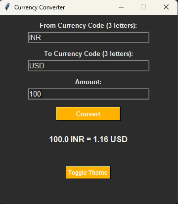

# 💱 Currency Converter GUI (Python + Tkinter)

A simple, elegant desktop application that converts currencies using real-time exchange rates. Built with Python and Tkinter, and includes light/dark theme toggle support! 🌗

---

## 📚 Table of Contents

- [🚀 Features](#-features)
- [🖼️ App Preview](#️-app-preview)
- [⚙️ How to Run](#️-how-to-run)
- [🔐 API Access Notes](#-api-access-notes)
- [👤 Signature](#-project-admin)

---

## 🚀 Features

- 💵 Convert any currency to another using **live exchange rates**
- 🌗 Toggle between **light and dark themes**
- ✅ Validates user input with helpful error messages
- 💡 Beginner-friendly GUI design using Tkinter

---

## 🖼️ App Preview

> Example:  
> 
> 

---

## ⚙️ How to Run

1. **Clone this repo**
   ```bash
   git clone https://github.com/UTSAV26/PyVerse.git
   cd PyVerse/Beginner_Projects/API-key_free_Currency_Converter
   ```

2. **Create a Virtual Environment**
   ```bash
   python -m venv venv
   source venv/Scripts/activate ----> for ac use: venv/bin/activate
   ```
3. **Install dependencies**
   - Make sure Python 3.6+ is Installed
   - (Only `requests` is needed)
      ```bash
      pip install requests
      ```
   - Tkinter is usually pre-installed with Python. If not:
      - On Windows: Install Python from the official website
      - On Linux: sudo apt-get install python3-tk
      - On Mac: Already included with Python

4. **Set your API-Key**
   - Create a file called `.env` in the project folder
   - Add your CurrencyFreaks key:
      ```ini
      API_KEY=your_key_here
      ```

5. **Run the application**
   ```bash
   currency_converter.py
   ```

---

## 🔐 API Access Notes

This app currently uses the **[CurrencyFreaks API](https://www.currencyfreaks.com/)** 
Follow these steps:

1. **Check the official docs:**
2. **API key is required**:
   - Register for one on their website. Copy your API Key
   - Create a file named `.env` in the project folder. (if it dooesn't alr exist)
   - Add your CurrencyFreaks key:
      ```ini
      API_KEY=your_key_here
      ```
   - For security:
     - Never commit API keys to GitHub

3. **Alternative APIs you can switch to**:
   - [Open Exchange Rates](https://openexchangerates.org/)

---

### Ways to Contribute:
- 🐛 Report issues or bugs
- 🎨 Improve the UI or theme
- 🌍 Add localization/multi-language support

Fork the repo, make your changes, and open a PR! 💖

---

## 👤 Signature:

> **Yashasvi Jain**  
> Github: https://github.com/Y4shu     
> LinkedIn: https://www.linkedin.com/in/yashasvi-jain-44a553322/

---
