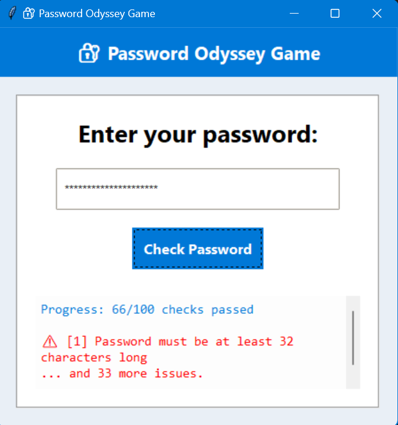

# Password Odyssey

A Python-based game where players try to create a password following several conditions.

## Overview

The game challenges you to craft a password that satisfies unique and tricky rules. Feedback is shown in the GUI window after each attempt, highlighting the first failed condition.

## Features

* unique password rules (length, letters, digits, symbols, patterns).
* Tkinter-based GUI with input box and results window.
* Instant feedback after every password attempt.

## Requirements

* Python 3.x

## Installation

```bash
git clone <repo-url>
cd Beginner_Projects\\Password_Odyssey_Game
python game.py
```

## How to Play

1. Run the script.
2. Enter a password in the GUI.
3. Fix conditions until all pass.
4. Close the window to exit.

## Example Password

```
baf1gSUNhiejklmopr5stu$w9c#w!d101b*w934ww0w2
```

## Screenshot

Here’s how the GUI looks in action:



## Notes

* Game highlights the first failed condition.
* Password must satisfy **all rules** to win.

