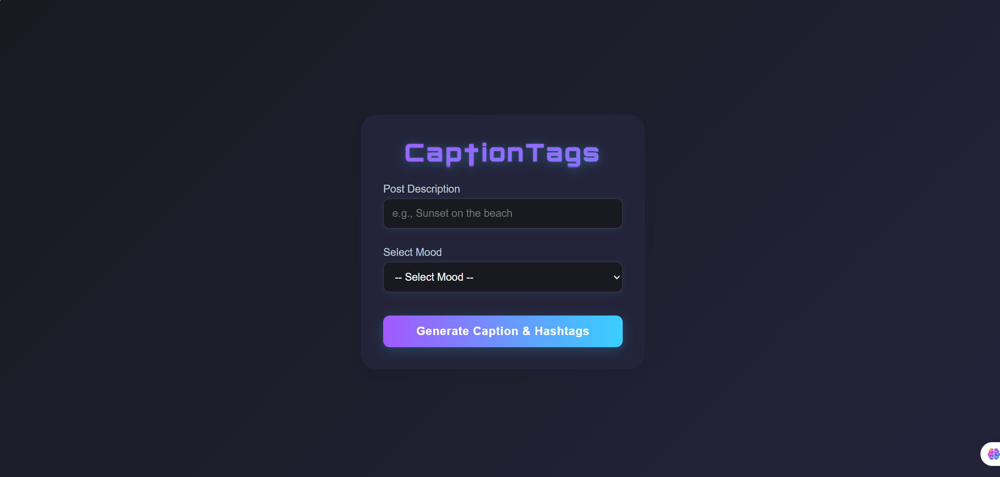
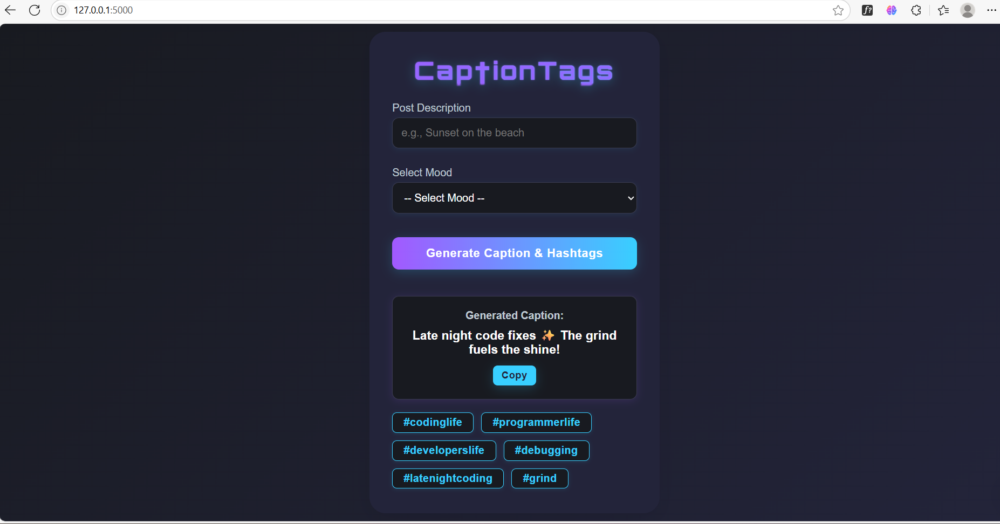

# Cap†ionTags

A modern, dark-themed web app for generating unique Instagram captions and hashtags using Google Gemini AI. Save your favorite captions locally with a single click!

## Features

- ✨ Generate creative Instagram captions based on your post description and mood
- 🏷️ Instantly get a set of relevant hashtags for your post
- 🌙 Beautiful, fully responsive dark theme with a bold, unique logo
- 📋 One-click copy for captions

## Demo


<!-- Add your screenshot here -->

## Tech Stack & Purpose

| Technology                    | Purpose                                                               |
| ----------------------------- | --------------------------------------------------------------------- |
| Flask                         | Python web framework for backend, routing, and serving HTML templates |
| Google Generative AI (Gemini) | Generates captions and hashtags using advanced AI models              |
| python-dotenv                 | Loads API keys and environment variables securely from a `.env` file  |
| HTML/CSS/JS                   | Frontend UI, dark theme, responsive design, and interactive features  |
| Regex (re module)             | Extracts and cleans up AI-generated captions and hashtags in backend  |

## Setup Instructions

### 1. Clone the repository

```bash
git clone <repo-url>
cd <repo-folder>
```

### 2. Create and activate a virtual environment (optional but recommended)

```bash
python -m venv venv
# On Windows:
venv\Scripts\activate
# On Mac/Linux:
source venv/bin/activate
```

### 3. Install dependencies

```bash
pip install flask google-generativeai python-dotenv
```

### 4. Get your Gemini API key

- Go to [Google AI Studio](https://aistudio.google.com/app/apikey) and create an API key.
- Create a `.env` file in the project root:
  ```
  GOOGLE_API_KEY=your-gemini-api-key-here
  ```

### 5. Run the app

```bash
python app.py
```

Visit [http://127.0.0.1:5000/](http://127.0.0.1:5000/) in your browser.

## Usage

1. Enter your Instagram post description and select a mood.
2. Click **Generate Caption & Hashtags**.
3. Copy your caption to the clipboard using the Copy button.
4. View the generated hashtags below the caption.

## Customization

- Edit `app.py` to change prompt logic or model settings.
- Tweak `templates/index.html` for UI/UX changes.

## License

MIT
