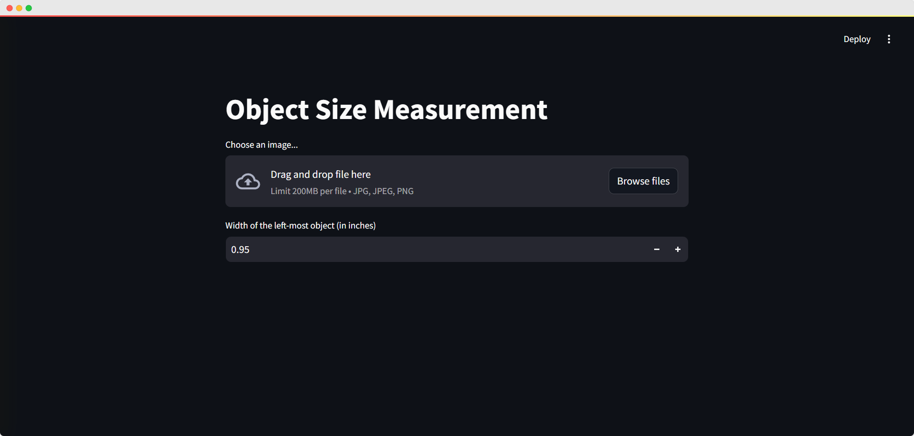
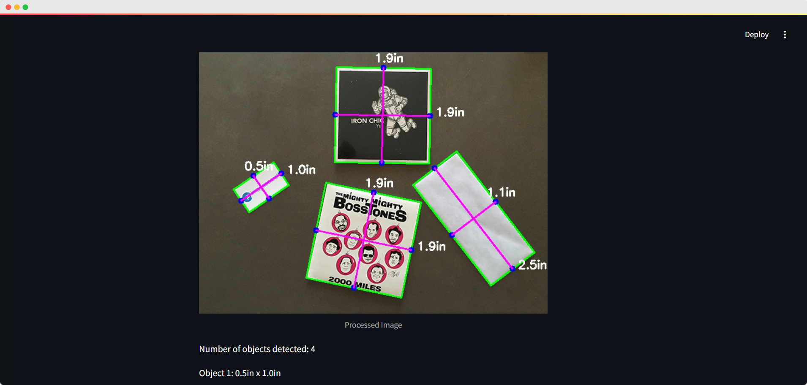

# Object Size Detection

This Project creates an app where users can upload an image to measure the size of objects in it. After uploading, the app detects objects, measures their height and width based on a reference size, and displays the image with dimensions marked on each object. It also shows the total number of objects found and lists each object’s size.


## Tech Stack

**Languages:** Python

**Libraries:**  opencv,numpy etc

**Framework:** Streamlit

## Project Structure

Here's an overview of the main files and folders in this project:

```plaintext
├── app.py              
├── requirements.txt     
├── README.md         
└── Results
    ├── res1.png
    ├── res2.png
    └── res3.png   

```
## Screenshots




## Run Locally

Install dependencies

```bash
  pip install -r requirements.txt
```

Start the server

```bash
  streamlit run app.py
```


