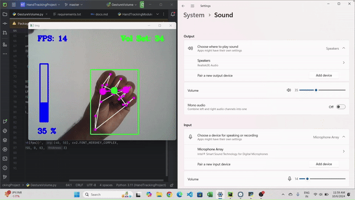

# Gesture-Based Volume Control


[](https://www.python.org/)
[](./LICENSE)
[](https://github.com/psf/black)


Control your system volume with hand gestures using computer vision and hand tracking technologies.

## Overview



This project enables users to control system volume using intuitive hand gestures. By leveraging computer vision and hand tracking, we've created a touchless interface that adjusts volume based on the distance between your thumb and index finger. This solution enhances accessibility and provides an innovative approach to user interaction.

## Tech Stack

- **Python 3**
- **OpenCV**: For capturing video frames and image processing
- **Mediapipe**: For real-time hand detection and tracking
- **PyCaw**: For interacting with system audio settings
- **NumPy**: For numerical operations and interpolation
- **Custom HandTrackingModule**: A purpose-built module for advanced hand tracking features

## Key Features

- 🎮 **Gesture-Based Volume Control**: Adjust system volume by changing the distance between thumb and index finger
- 🔍 **Real-time Hand Detection**: Instant hand gesture recognition using Mediapipe
- 📊 **Smooth Transition**: Optimized gesture recognition for fluid volume adjustments
- 🛠️ **Custom HandTrackingModule**: Enhanced capabilities for finger tracking and gesture recognition

## Getting Started

### Prerequisites

- Computer with a webcam
- Python 3.x installed

### Installation

1. Clone the repository:
   ```bash
   git clone https://github.com/yourusername/gesture-volume-control.git
   ```

2. Navigate to the project directory:
   ```bash
   cd gesture-volume-control
   ```

3. Install required dependencies:
   ```bash
   pip install -r requirements.txt
   ```

### Running the Tool

1. Start the application:
   ```bash
   python VolumeControl.py
   ```

2. Use hand gestures to control volume:
   - Bring thumb and index finger closer for lower volume
   - Move them apart for higher volume

3. Press 'Esc' to exit the application

## How it Works

1. The webcam detects your hand in real-time
2. Position your hand in front of the camera
3. Adjust volume by changing thumb-index finger distance:
   - Closer = Lower volume
   - Wider = Higher volume
4. On-screen display shows current volume percentage

## Custom HandTrackingModule

Our custom-built module enhances Mediapipe functionality with:
- Precise hand landmark detection
- Real-time distance calculation between fingers
- Specialized gesture recognition for volume control

## Applications

- **Accessibility**: Touchless control for users with mobility challenges
- **Hands-Free Environments**: Ideal for presentations or cooking scenarios
- **Innovation**: Stepping stone for future gesture-based interfaces

## Documentation

For detailed instructions and API documentation, visit our [Documentation](https://github.com/mjgandhi2305/Gesture-Volume-Control/blob/master/docs/docs.md).

## License

This project is licensed under the Apache License 2.0 - see the [LICENSE](LICENSE) file for details.

## Contact

For questions or feedback:
- 📧 Email: mjgandhi2305@gmail.com
- 🐙 GitHub: [@mjgandhi2305](https://github.com/mjgandhi2305)

---

<div align="center">

**Made with ❤️ by Miten Gandhi**

</div>
