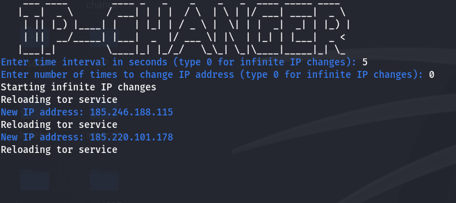
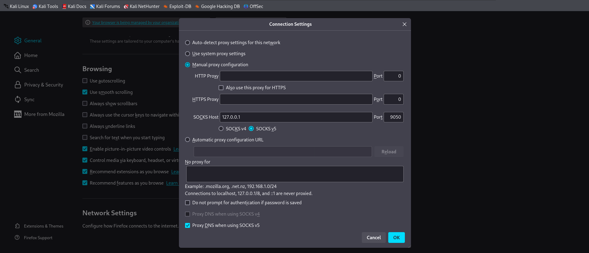

# IP-Changer

Bash script that uses Tor to change your IP at specified intervals.
Need Linux Distro like Kali Linux, Arch Linux, Red Hat etc.




## Usage

Run the script with root privileges:
```shell
chmod +x ip-changer.sh
```
---
```shell
sudo ./ip-changer.sh
```

## Browser Proxy Config
- Add custom proxy to browser to use tor IP it is entry node to tor network to use the random IP given by tor 


---
- First, enter how long you want to stay on one server before changing the IP.
Then, enter how many times to change the IP. Enter 0 for unlimited changes.