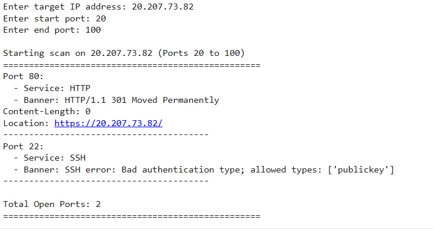

# 🔍 Network Vulnerability Scanner

A powerful yet simple network vulnerability scanner built in Python! This tool is designed to help identify open ports, detect running services, and retrieve service banners to assist with vulnerability assessment. Featuring multithreading for efficiency and SSH support for secure banner grabbing, it’s ideal for network admins, security enthusiasts, and developers.

## 📋 Features
- 🔎 **Port Scanning**: Scans a specified range of ports on a target IP to identify open ports.
- 🛠 **Service Detection**: Identifies common services (HTTP, FTP, SSH, etc.) on open ports.
- 📜 **Banner Grabbing**: Retrieves banners from services to reveal potential vulnerabilities.
- 🔐 **SSH Banner Fetching**: Uses Paramiko for secure SSH banner retrieval.
- ⚡ **Multithreaded Scanning**: Scans multiple ports concurrently to maximize speed and efficiency.

## 🚀 Benefits
- **Enhanced Network Security**: Quickly identify open ports and services on your network, making it easier to lock down unused or unnecessary services.
- **Risk Assessment**: Fetches banners that may contain version information, helping you spot potentially vulnerable services and take action.
- **Speed & Efficiency**: Utilizing multithreading, the scanner covers a large range of ports in a short time, providing fast, actionable results.
- **Customizable**: The script can be adapted or expanded based on your needs, offering flexibility for both basic and advanced users.
- **Educational Value**: Great for learning the fundamentals of network security, service detection, and banner grabbing!

## 🛠 Tech Stack
- **Python**: Core programming language for the scanner
- **Socket Module**: Manages network connections and performs port scanning
- **ThreadPoolExecutor**: Handles multithreading for efficient scanning
- **Paramiko**: Enables SSH connections and secure banner retrieval on port 22

## 📦 Installation
1. Clone the repository:
   ```
   git clone https://github.com/UTSAVS26/PyVerse/tree/main/Cybersecurity_Tools
   cd network_Scanner
1. Install dependencies:
   ```
   pip install paramiko
   pip install scapy
## 🚀 Usage
Run the scanner by providing the target IP address and the range of ports to scan.
```
python main.py
```
Example Run:




## 📜 Note
To know the IP address of any website in CMD use:
```
ping "website_URL"
```
### ⚠️ Important Notes
- **Use Responsibly**: Scanning networks without permission is prohibited by law.
- **SSH Support**: Ensure Paramiko is installed via `pip install paramiko` for SSH banner grabbing to work.
- **Limitations**: Some services may block or prevent banner retrieval to limit exposure.

Happy coding! 

Jivan Jamdar
