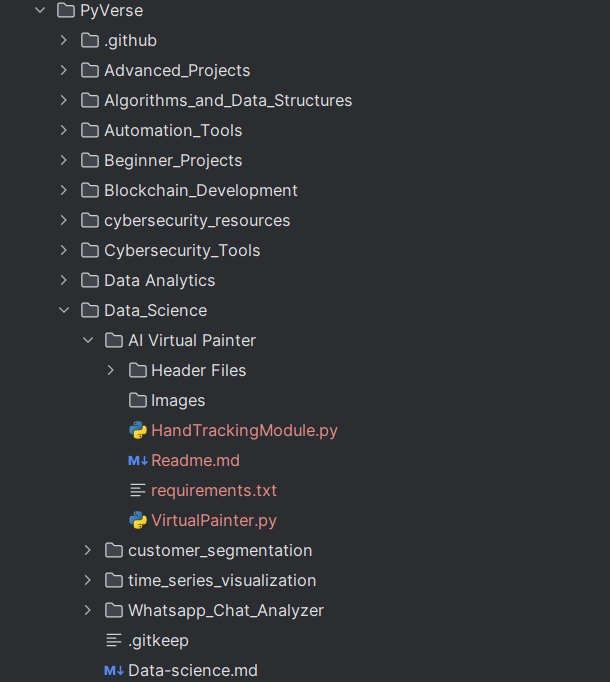
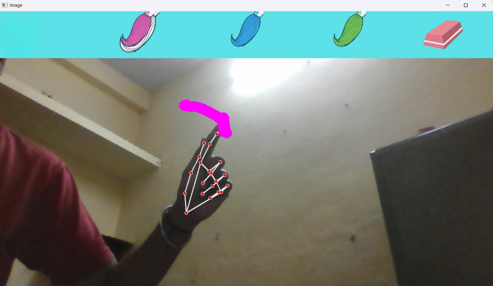

# AI Virtual Painter Project

## AIM
Create a real-time interactive AI tool that uses hand gestures to allow users to paint or draw virtually using their camera feed.

## DESCRIPTION
The **AI Virtual Painter** project utilizes computer vision techniques to detect hand gestures and track finger movements in real-time, transforming these gestures into painting or drawing actions on the screen. This project leverages libraries like OpenCV and MediaPipe for hand detection and tracking, allowing users to interact with the system through gestures. 

### Why is this project necessary?
This project showcases the innovative application of AI in enhancing user interaction without physical touch, particularly useful in creating virtual experiences. It’s beneficial for artists, educators, and anyone looking for creative ways to engage with digital tools.

### How is it beneficial and used?
The virtual painter can be used for:
- Teaching and creative drawing experiences.
- Gesture-controlled applications.
- Fun and interactive painting applications.

### How did you start approaching this project?
I began by researching hand detection techniques and gesture-based controls using OpenCV and MediaPipe. After building a basic hand-tracking system, I incrementally added drawing capabilities, color selection, and an eraser feature.

## EXPLANATION

### DETAILS OF THE DIFFERENT FEATURES
1. **Hand Detection and Tracking**: Using MediaPipe to detect and track hand landmarks.
2. **Drawing**: Raising the index finger allows the user to draw on the screen.
3. **Color Selection**: Both index and middle fingers raised allows color selection from the virtual palette.
4. **Eraser**: Switches to eraser mode based on the gesture selection.

### WHAT I HAVE DONE
1. Implemented real-time camera feed capture.
2. Integrated hand detection using MediaPipe.
3. Added virtual painting and erasing capabilities.
4. Created gesture-based interaction for selecting different colors and tools.
5. Implemented a virtual header to house drawing tools.
6. Enhanced the system for smooth tracking and minimal lag.

### Controls for the AI Virtual Painter

#### 1. Header Interaction
- Use your right hand with both the **index and middle fingers** raised to hover over the header.
- This gesture allows you to select between different tools and colors: **pink, blue, green**, or the **eraser**.

#### 2. Drawing and Erasing
- Raise only your **index finger** to draw or erase on the screen.
- The action (drawing or erasing) depends on your current selection from the header.

#### 3. Gesture Control
- Ensure that your hand gestures are clear and visible to guarantee smooth interaction.
- This will help in achieving precise drawing and erasing operations.

### LIBRARIES NEEDED
- OpenCV
- MediaPipe
- NumPy

### SCREENSHOTS
1. **Project structure**:  
     
2. **Visualization of hand tracking and painting actions**:  
     

### MODELS USED AND THEIR ACCURACIES
This project does not involve traditional ML models but instead focuses on real-time computer vision for gesture detection.

## CONCLUSION

### WHAT YOU HAVE LEARNED
- Real-time hand detection and tracking using MediaPipe.
- Gesture-based interaction for virtual environments.
- Building interactive applications with minimal lag using computer vision.

### USE CASES OF THIS MODEL
1. **Virtual Art Studio**: Artists can create digital art using hand gestures without any physical tools.
2. **Interactive Teaching Tool**: Teachers can engage students by drawing and explaining concepts interactively.

### HOW TO INTEGRATE THIS MODEL IN REAL WORLD
1. **Prepare the data pipeline**: Ensure a high-quality camera feed is available for smooth hand-tracking.
2. **Deploy the model**: Use tools like Flask or Streamlit to deploy the AI Virtual Painter as a web application.
3. **Monitor and maintain**: Keep the hand detection models updated for improved accuracy in future versions.

### FEATURES PLANNED BUT NOT IMPLEMENTED
- **Save Drawings Feature**: The ability to save drawings created on the virtual canvas.
- **Multi-user Interaction**: Supporting multiple users in real-time.

*Rohit Motwani*

#### Happy Coding 🧑‍💻
### Show some &nbsp;❤️&nbsp; by &nbsp;🌟&nbsp; this repository!
