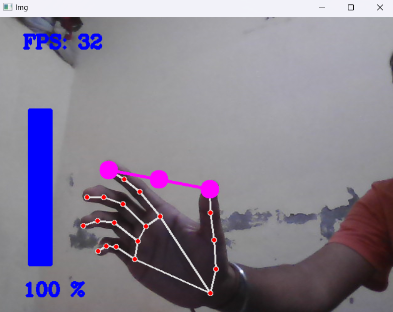

# Gesture-Based Volume Control 

## AIM
To develop a system that allows users to control the volume of a device using hand gestures made with the right hand’s index finger and thumb.

## DESCRIPTION
The Gesture-Based Volume Control project aims to create an intuitive way to control the volume of a device without physically touching it, using a hand gesture recognition system. This project is based on the need for touchless control of multimedia, especially in environments where physical contact with devices is not feasible or convenient.

### How is it Beneficial and Used?
The touchless volume control feature is beneficial for users looking for hands-free interaction with their devices, enhancing accessibility and user experience. It can be used in various scenarios such as:
- Media playback control
- Assistive technology for differently-abled individuals

### How I Approached the Project
I started by identifying the core elements of the system:
1. Real-time gesture tracking (camera feed or sensor)
2. Gesture detection model to identify thumb and index finger
3. Mapping the gestures (pinching or separation) to volume control

## EXPLANATION

### DETAILS OF THE DIFFERENT FEATURES
1. Gesture Recognition: Detecting the thumb and index finger movements.
2. Real-Time Processing: The system processes the video feed in real time to track the gestures.
3. Volume Mapping: The gesture movements are mapped to the volume control feature.

### SCREENSHOTS
Include screenshots of:
1. The project’s folder structure

2. Screenshots of the gesture detection in action

## CONCLUSION

### WHAT YOU HAVE LEARNED
- Real-time video processing techniques using OpenCV.
- How to build and optimize machine learning models for gesture detection.
- Handling trade-offs between model performance and real-time system requirements.

### USE CASES OF THIS MODEL
1. Touchless Control for Media Systems: Allows users to adjust volume without touching the device.
2. Assistive Technology: Provides an accessible interface for differently-abled users to control devices.

### HOW TO INTEGRATE THIS MODEL IN REAL WORLD
1. Set up a camera to capture hand gestures.
2. Deploy the gesture detection model using Flask or TensorFlow Serving.
3. Create an interface to connect the detected gestures with the device's volume control system.
4. Monitor and maintain the system for performance in real-world scenarios.

### FEATURES PLANNED BUT NOT IMPLEMENTED
- Multi-Device Control: Extending the system to control multiple devices with the same gesture interface.

### YOUR NAME
Rohit Motwani

#### Happy Coding 🧑‍💻
### Show some &nbsp;❤️&nbsp; by &nbsp;🌟&nbsp; this repository!

