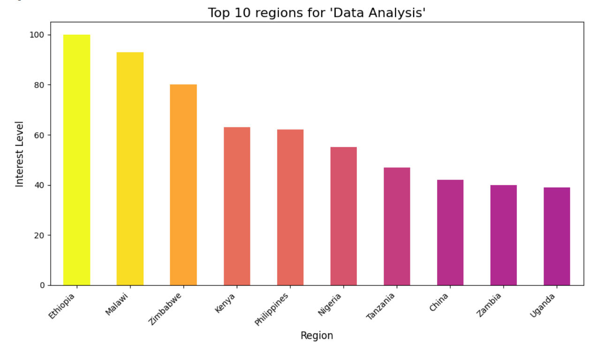

# Google Search Analysis with Python

## 🎯 Goal
The goal of this project is to perform keyword "Data Analysis" using PyTrends to uncover search trends, regional interest, and trending topics in India. The purpose is to visualize Google search patterns and gain insights into user behavior over time.

## 🧵 Data Source
- Data Source: PyTrends (Google Trends API)

## 🧾 Description
This project utilizes PyTrends to fetch real-time Google search data. Various keyword analyses, regional interest, and trending topics in India are explored using data visualization techniques. The analysis includes interest over time, regional comparisons, and trending search topics.

## 🧮 What I had done!
1. Connected to the Google Trends API using PyTrends.
2. Fetched keyword search data for analysis.
3. Performed regional analysis to observe interest by location.
4. Visualized interest over time for selected keywords.
5. Created various visualizations such as bar charts,line charts, pie charts, and scatter plots.
6. Also Trending topics in India to understand current search behavior.

## 🚀 Models Implemented
No machine learning models were implemented, as this project focuses on data analysis and visualization of search trends.

## 📚 Libraries Needed
- `pytrends`
- `pandas`
- `numpy`
- `matplotlib`
- `seaborn`
- `plotly`

## 📊 Exploratory Data Analysis Results

## 📈 Performance of the Models based on the Accuracy Scores
This project does not involve machine learning models, so no accuracy scores were calculated.

## 📢 Conclusion
The Google Search Analysis successfully provided insights into search trends and regional interests in India using PyTrends. Visualizations such as interest over time, bar charts, and pie charts reveal key trends in user searches. Analyzing trending topics gives a deeper understanding of what’s currently popular among users.

## ✒️ Your Signature
**Shreya Tripathy**

[GitHub Profile](https://github.com/Shreya7tripathy)

Thanks :)
