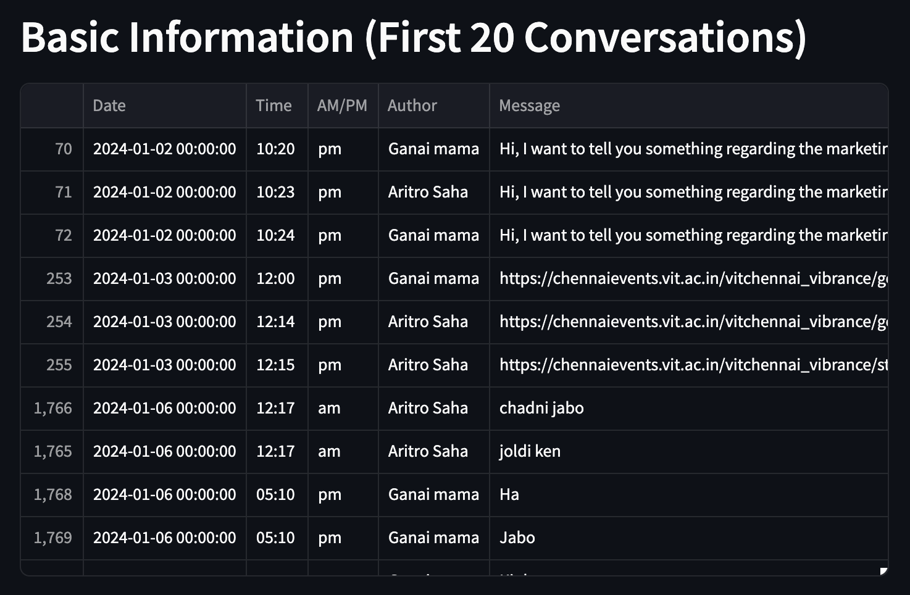
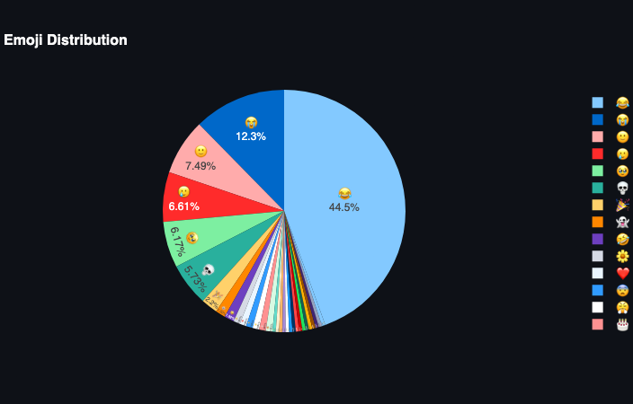
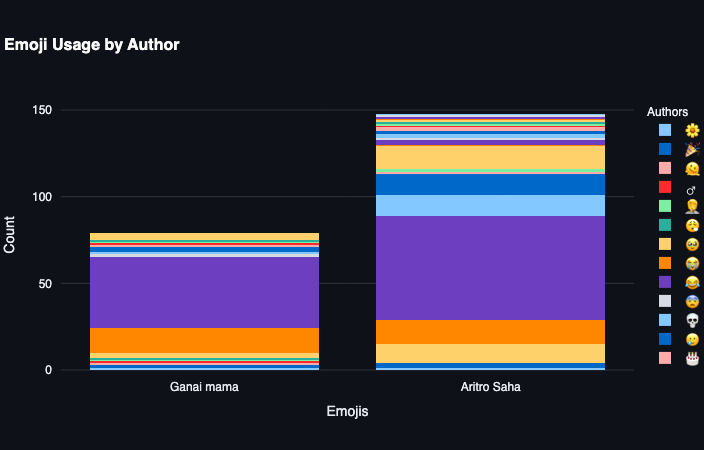
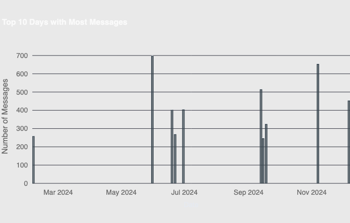
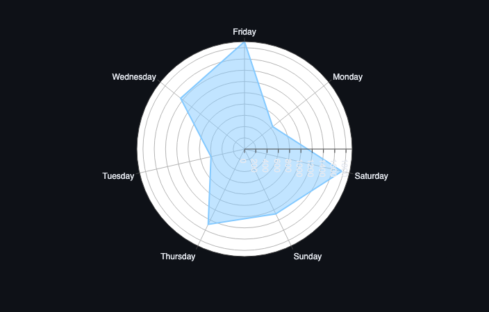
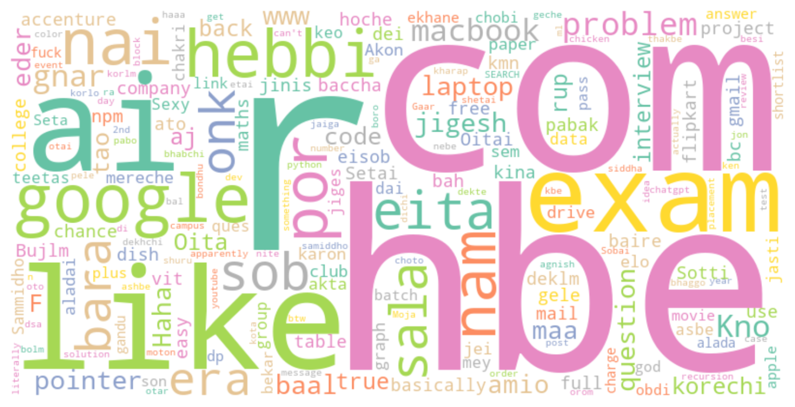

## **WhatsApp Chat Analyzer**

### 🎯 **Goal**

The main goal of this project is to analyze WhatsApp chat data to derive meaningful insights, such as user engagement, emoji usage, and response patterns. It aims to provide an interactive visualization to explore user activity within a chat.

### 🧵 **Dataset**

The dataset is provided by the user in the form of a `.txt` or `.zip` file, which contains WhatsApp chat data exported from the messaging app.

### 🧾 **Description**

This project allows users to upload WhatsApp chat files, which are then processed to extract useful information, including message counts, emoji usage, and response times. The data is visualized using interactive charts and plots, enabling easy exploration of user behavior in the chat.

### 🧮 **What I had done!**

1. Implemented a file upload feature to allow users to upload WhatsApp chat files (`.txt` or `.zip`).
2. Processed the uploaded chat data to extract relevant information using regular expressions.
3. Extracted details such as date, time, author, message content, and emojis.
4. Analyzed message data to calculate statistics like messages sent, average response time, word count, and emoji usage.
5. Visualized the extracted information using various charts such as pie charts, bar charts, and polar plots.
6. Generated a word cloud of the most frequently used words in the chat.

### 🚀 **Models Implemented**

No machine learning models were used in this project. Instead, the focus is on text processing, data analysis, and visualization of chat data.

### 📚 **Libraries Needed**

- `streamlit` - For creating the web application.
- `pandas` - For handling and processing data.
- `plotly.express` and `plotly.graph_objs` - For creating interactive visualizations.
- `matplotlib.pyplot` and `seaborn` - For additional plotting and visualization.
- `wordcloud` - For generating a word cloud.
- `nltk` - For stopwords and text processing.
- `emojis` - For extracting emojis from messages.
- `collections.Counter` - For counting occurrences of emojis.
- `numpy` - For numerical operations.
- `requests` - For downloading custom stopwords.
- `re` - For regular expressions.
- `zipfile`, `io` - For handling file uploads in `.zip` format.

### 📊 **Exploratory Data Analysis Results**

Below are some visualizations derived from the chat data:

1. **Basic Information**  
   
   
2. **Emoji Distribution**  
   

3. **Emoji Usage by Author**  
   

4. **Top 10 Days With Most Messages**  
   

5. **Message Distribution by Day**  
   

6. **Word Cloud**  
   

### 📈 **Performance of the Models based on the Accuracy Scores**

No machine learning models were used in this project. It is purely focused on data analysis and visualization of WhatsApp chat data.

### 📢 **Conclusion**

This project successfully provides an interactive analysis of WhatsApp chat data, including statistics on user engagement, emoji usage, and response times. Users can explore individual and group message patterns, and the visualizations make it easy to understand user behavior. This type of analysis can be helpful for studying group dynamics or understanding communication patterns.

### ✒️ **Your Signature**

Created by Aritro Saha -  
[Website](https://aritro.tech/) | [GitHub](https://github.com/halcyon-past) | [LinkedIn](https://www.linkedin.com/in/aritro-saha/)