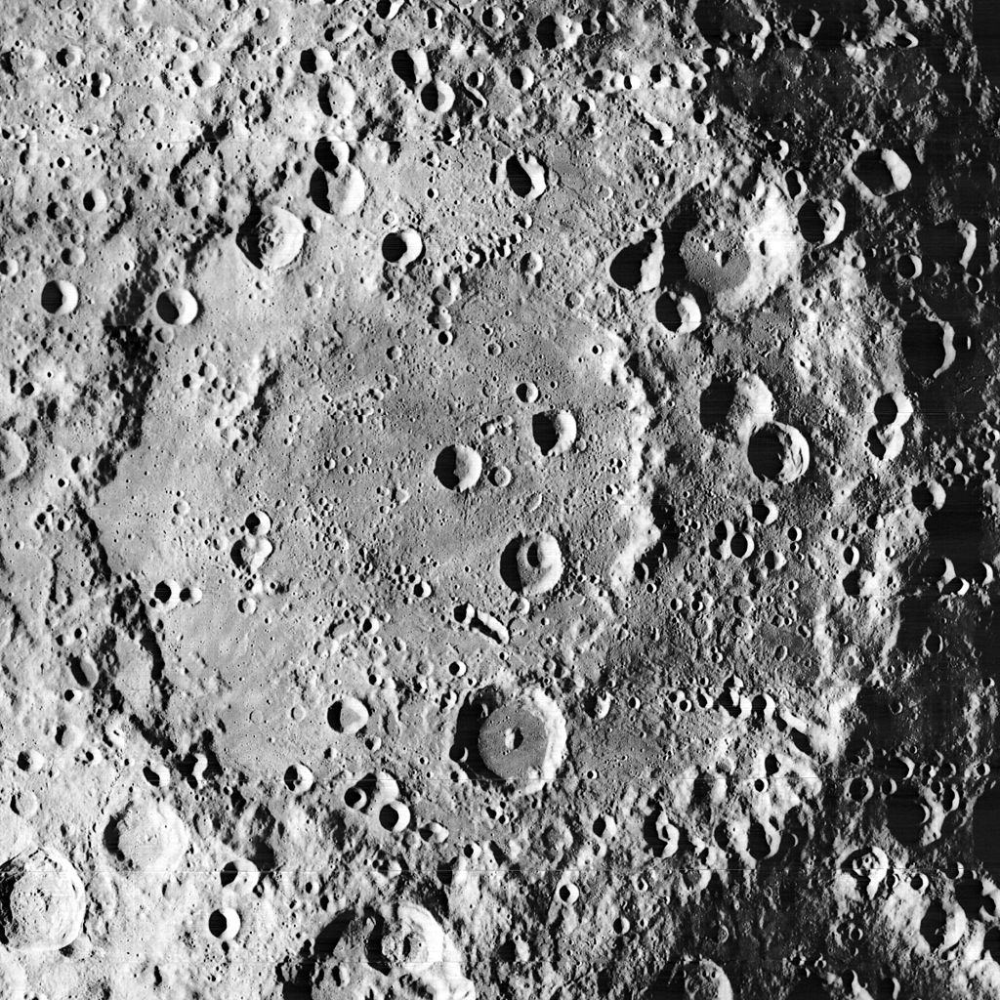
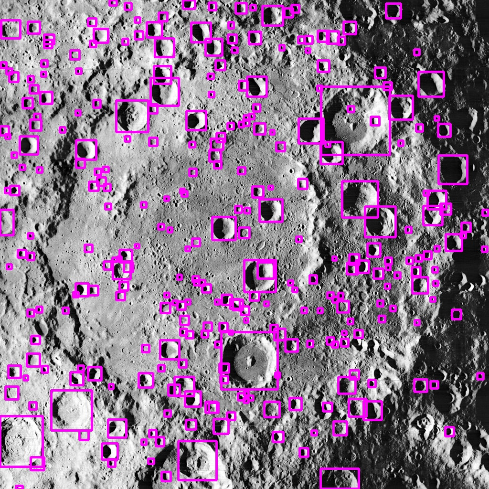

# Crater Detection Model

This repository contains a machine learning model for detecting lunar craters, particularly focusing on low-light regions like the Permanently Shadowed Regions (PSR) of the moon. The model leverages advanced object detection techniques to improve surface mapping and assist in identifying potential landing sites on the lunar surface.

## Table of Contents
- [Overview](#overview)
- [Dataset](#dataset)
- [Model Architecture](#model-architecture)
- [Usage](#usage)
- [Results](#results)

## Overview
Accurate detection of lunar craters is essential for tasks such as identifying safe landing sites and analyzing the lunar surface. This crater detection model is designed to work efficiently even in low-light conditions found in PSR areas. By incorporating this model, lunar mapping missions can achieve higher precision and reliability.

## Dataset
The model was trained on the **Impact Moon Craters (LU3M6TGT)** dataset, which contains:

- Lunar surface images
- Ground truth annotations for craters

## Model Architecture
The crater detection model is built using **YOLOv8**, a state-of-the-art Convolutional Neural Network (CNN) for object detection. Key features include:
- **Input size**: 640x640 pixels (adjustable)
- **Object detection**: Accurately identifies lunar craters and relevant features
- **Low-light optimization**: Fine-tuned for detecting craters in Permanently Shadowed Regions (PSR)

## Usage

1. **Run the Jupyter Notebook:**
    - Open the `crater_detection.ipynb` notebook and run all the cells to train and test the model.
    
    Alternatively, to run it from the terminal:

    ```bash
    jupyter notebook crater_detection.ipynb
    ```

2. **Training and Testing:**
    - Modify the dataset path or model parameters within the notebook if necessary.
    - Visualize the detected craters using the output provided at the end of the notebook.

## Results
The model effectively detects craters in high-resolution lunar images, especially in challenging low-light areas. Below is a sample visualization:

| Input Image | Crater Detection Output |
| ----------- | ----------------------- |
|  |  |
