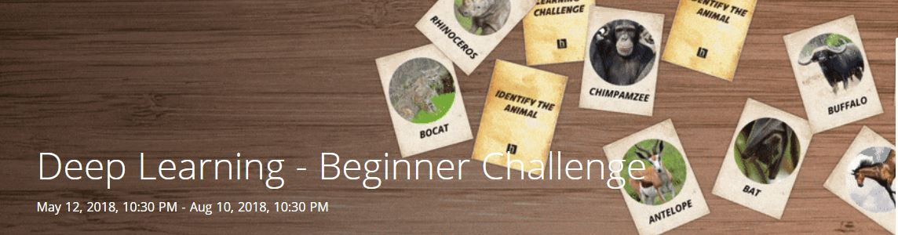

# **Identify the Animal challenge** 

[Challenge link](https://www.hackerearth.com/challenge/competitive/deep-learning-beginner-challenge/problems/) 

[//]: # (Image References)

[image1]: ./images/sub.jpg "submission"
[image2]: ./images/LeaderBoard.jpg "LeaderBoard"

## ABOUT CHALLENGE :

For several years, animal detection in the wildlife has been an area of great interest among biologists. They often study the behaviour of the animals to predict their actions. Since there are a large number of different animals, manually identifying them can be a daunting task. So, an algorithm that can classify animals based on their images can help researchers monitor them more efficiently. Also, animal detection and classification can help prevent animal-vehicle accidents, trace animal facility, prevent theft, and ensure the security of animals in zoos.

The application of deep learning is rapidly growing in the field of computer vision and is helping in building powerful classification and identification models. We can leverage this power of deep learning to build models that can classify and differentiate between different species of animals as well.

In this dataset, we provide 19,000 images of 30 different species of animals. In the next 90 days, we challenge you to build models such that given an image, the model will predict the probability of every animal class. The animal class with the highest probability will signify that the image belongs to that animal class.

## Problem Statement :
Wildlife images captured in a field represent a challenging task while classifying animals since they appear with a different pose, cluttered background, different light and climate conditions, different viewpoints, and occlusions. Additionally, animals of different classes look similar. All these challenges necessitate an efficient algorithm for classification.

In this challenge, you will be given 19,000 images of 30 different animal species. Given the image of the animal, your task is to predict the probability for every animal class. The animal class with the highest probability means that the image belongs to that animal class.

## Data Description:
You’re given two types of files (CSV and Images) to download. The train data consists of 13,000 images and the test data consists of 6,000 images of 30 different species of animals. The image ID and the corresponding animal name are stored in .csv format, while the image files are sorted into separate train and test image folders. Data in the .csv file is in the following format:

| Variable      | Description   | 
|:-------------:|:-------------:| 
| Image_id      | Image name       | 
| Animal        | Name of the Animal |  

Following are the 30 different species of animals in the dataset:
* antelope
* bat
* beaver
* bobcat
* buffalo
* chihuahua
* chimpanzee
* collie
* dalmatian
* german+shepherd
* grizzly+bear
* hippopotamus
* horse
* killer+whale
* mole
* moose
* mouse
* otter
* ox
* persian+cat
* raccoon
* rat
* rhinoceros
* seal
* siamese+cat
* spider+monkey
* squirrel
* walrus
* weasel
* wolf

## [Data Download](https://s3-ap-southeast-1.amazonaws.com/he-public-data/DL%23+Beginner.zip)

## Submission
A participant has to submit a .csv file in the following format:

![alt text][image1]

## My sloution: 
#### Steps:
* I used Google colab so i didn't need a GPU
* I used fast.ai library which buit on pytorch 
* I used a pretrained model (ImageNet based model)  resnext101_64 (Deep Residual Networks)
* I added two fully connected layers 
* I choosed a good learning rate 
* I trained only those two layers then i trained the whole network and test on validation set
* I used data augmentation and Test Time Augmentation (TTA)
* After achieving good accuracy I trained again the network with all training examples  (no validation set) which should give me better results

## Results: 
* I have got Validation accuracy of 97.5 %
* I got the 4th place of the Leaderboard

#### [leaderboard](https://www.hackerearth.com/challenge/competitive/deep-learning-beginner-challenge/leaderboard/)

![alt text][image2]

