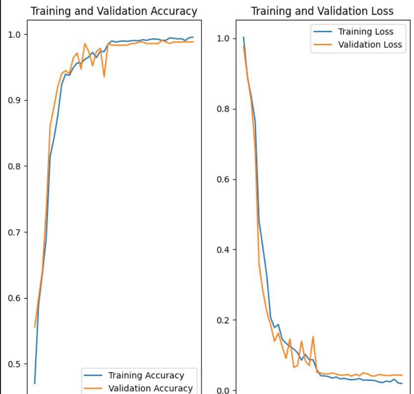
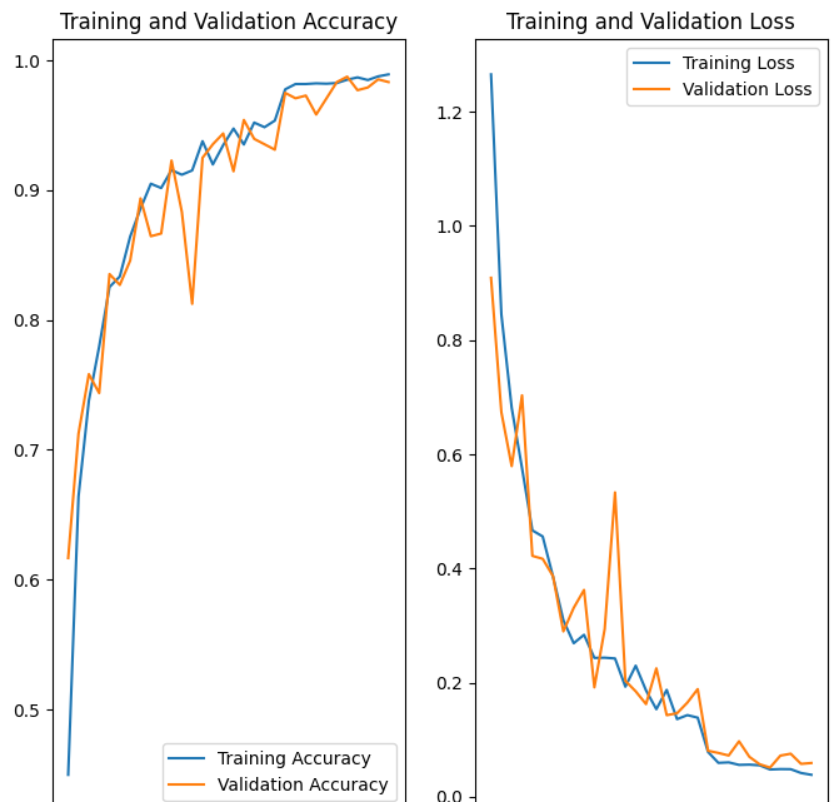
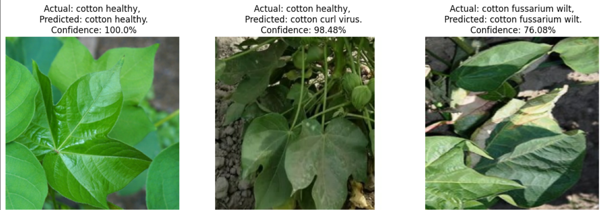
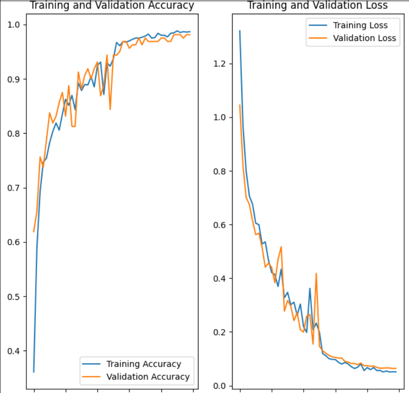
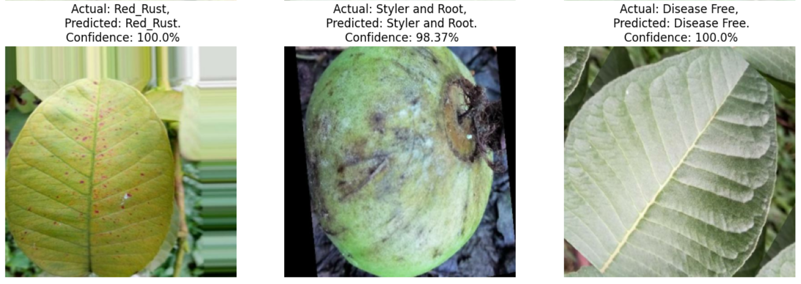
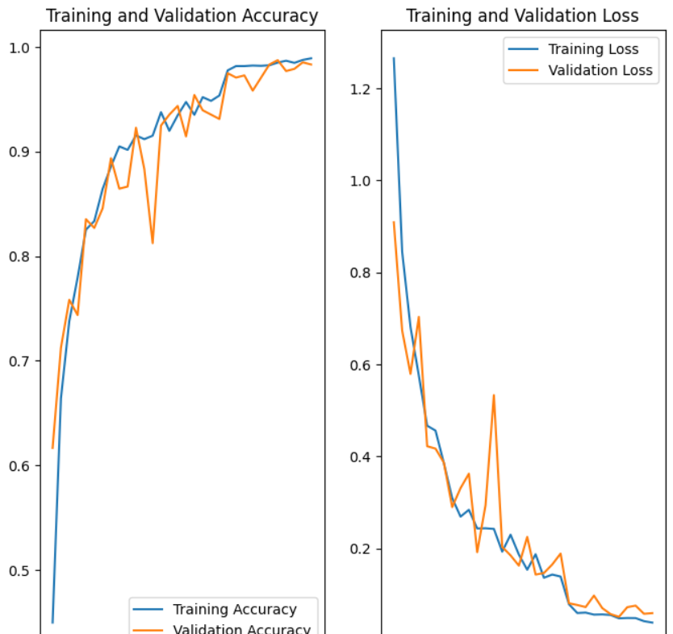
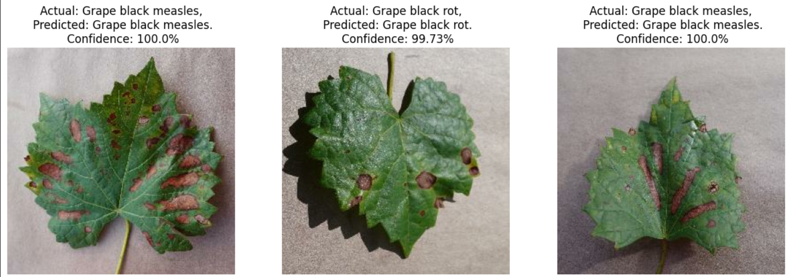
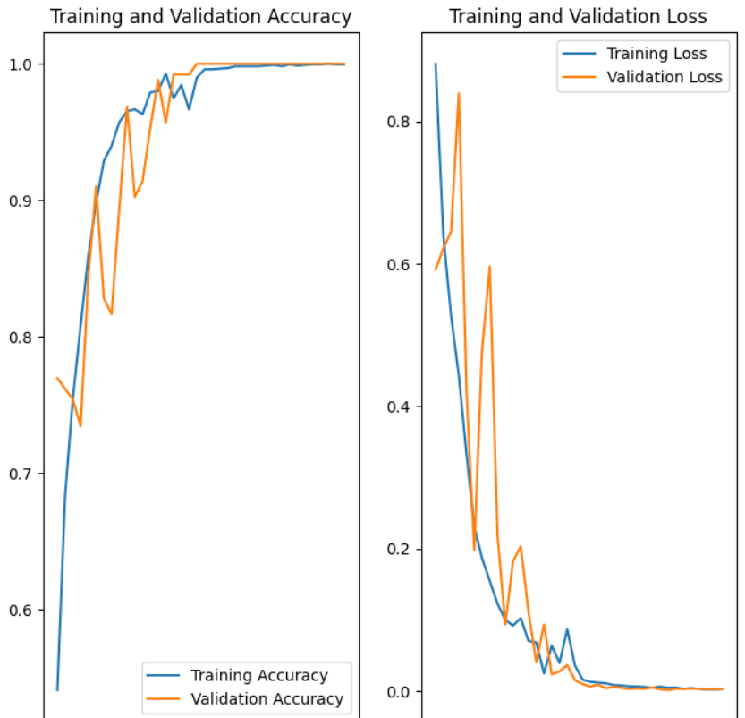
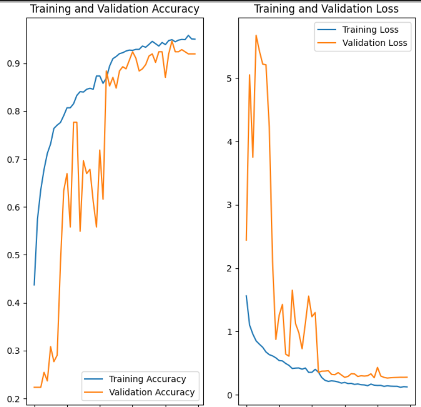

# Plant Disease Detection Results
The project focuses on creating multiple tensorflow models using CNN for disease detection of various plants.

## Table of Contents
- [Potato Image Classification](#potato-image-classification)
- [Tomato Image Classification](#tomato-image-classification)
- [Cotton Image Classification](#cotton-image-classification)
- [Guava Image Classification](#guava-image-classification)
- [Grapes Image Classification](#grapes-image-classification)
- [Sugarcane Image Classification](#sugarcane-image-classification)

## Potato Image Classification

### Model Overview
In this project, we aim to classify potato plant health into three categories: 

- **Early Blight**
- **Healthy**
- **Late Blight**

### Results
The classification model achieved an impressive accuracy of **98.02%** on the testing dataset. This high accuracy demonstrates the effectiveness of our model in distinguishing between healthy plants and those affected by early and late blight.

### Performance Chart

---

## Tomato Image Classification

### Model Overview
In this project, we aim to classify tomato plant health into ten categories:

- **Bacterial Spot**
- **Early Blight**
- **Late Blight**
- **Leaf Mold**
- **Septoria Leaf Spot**
- **Target Spot**
- **Tomato Yellow Leaf Curl Virus**
- **Tomato Mosaic Virus**
- **Two-Spotted Spider Mite**
- **Healthy**

### Results
The classification model achieved an impressive accuracy of **98.43%** on the testing dataset. This high accuracy demonstrates the model's effectiveness in identifying various tomato diseases and distinguishing healthy plants.

### Performance Chart

---

## Cotton Image Classification

### Model Overview
In this project, we aim to classify cotton plant health into four categories:

- **Cotton Bacterial Blight**
- **Cotton Curl Virus**
- **Cotton Fusarium Wilt**
- **Healthy**

### Results
The classification model achieved an accuracy of **97.40%** on the testing dataset, showcasing the model's capacity to effectively classify diseases in cotton plants.

### Result Checking

### Performance Chart

---

## Guava Image Classification

### Model Overview
In this project, we aim to classify guava plant health into two categories:

- **Anthracnose**
- **Healthy**

### Results
The classification model achieved an impressive accuracy of **98.43%** on the testing dataset, indicating its proficiency in detecting guava diseases.

### Result Checking

### Performance Chart

---

## Grapes Image Classification

### Model Overview
In this project, we aim to classify grape plant health into three categories:

- **Grape Black Measles**
- **Grape Black Rot**
- **Healthy**

### Results
The classification model achieved an impressive accuracy of **99.37%** on the testing dataset. This high accuracy demonstrates the model's ability to classify grape diseases effectively.

### Result Checking

### Performance Chart

---

## Sugarcane Image Classification

### Model Overview
In this project, we aim to classify sugarcane plant health into five categories:

- **Healthy**
- **Mosaic**
- **Red Rot**
- **Rust**
- **Yellow**

### Results
The classification model achieved an accuracy of **95.83%** on the testing dataset. This result reflects the model's effectiveness in detecting sugarcane diseases.

### Performance Chart

### Conclusion
The results indicate that the model performs exceptionally well in identifying and classifying potato plant diseases. Further enhancement can be achieved by adding more data and training on additional plant varieties.
The models can be deployed on web or app platform to help farmers detect crop diseases early and easily.

