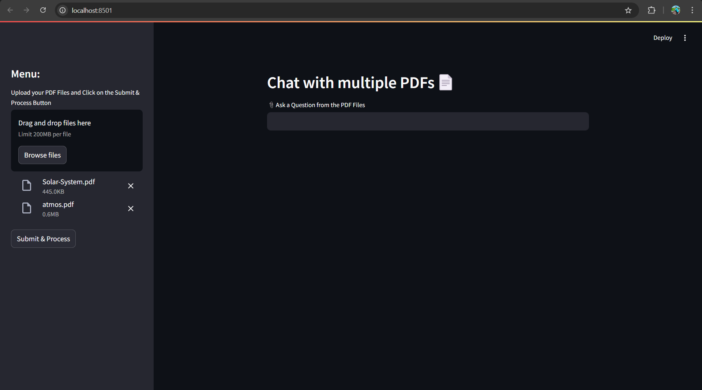

# PDF Wizard


📌 Overview
-----------

PDF Wizard is an AI-powered Streamlit web application that allows users to chat with multiple PDFs. It processes uploaded PDF files, extracts their text, converts them into embeddings, stores them in a FAISS vector database, and answers user queries based on the stored content using Google's Gemini AI.

🚀 Features
-----------

*   📂 Upload multiple PDF files
*   🧠 AI-powered chatbot using Google Gemini API
*   🔍 Search and retrieve context-based answers
*   📚 FAISS vector database for efficient document searching
*   ⚡ Streamlit-based interactive UI
    

🛠️ Tech Stack
--------------

*   Python
*   Streamlit
*   FAISS
*   Google Generative AI (Gemini API)
*   PyPDF2
*   LangChain
*   dotenv
    

📦 Installation
---------------
1. Clone the Repo
```
git clone https://github.com/UTSAVS26/PyVerse.git
cd Generative-AI 
cd PDF-Wizard
 ```   
2. Activate the environment  
```
python -m venv venv
```
```
source venv/bin/activate # For macOS/Linux
venv\Scripts\activate # For Windows
```
3. Install dependencies
`pip install -r requirements.txt`
    
4.  **Set Up Environment Variables**
    
    *   Create a .env file in the project root.
    *   GOOGLE\_API\_KEY= **your\_google\_api\_key**
        

🎯 Usage
--------

1.  Run the application
`streamlit run app.py`
    
2.  **Upload PDF files** via the sidebar.
    
3.  **Ask questions** based on the uploaded PDFs.
    
📂 ScreenShots
---------------------


📂 Project Structure
--------------------
```
PDF-Wizard
│-- faiss_index/         # Directory to store FAISS vectors
│-- app.py               # Main Streamlit app
│-- requirements.txt     # Required dependencies
│-- .env                 # API keys and environment variables
│-- README.md            # Project documentation
```

🌟 Acknowledgments
------------------

*   [Streamlit](https://streamlit.io/)
*   [FAISS](https://faiss.ai/)
*   [Google Generative AI](https://ai.google.dev/)

👤 Contributor 
---------------- 
- **Name:** Arnab Ghosh
- **GitHub:** [tulug-559](https://github.com/tulu-g559)  
- **Contact:** [email](garnab559@gmai.com)  