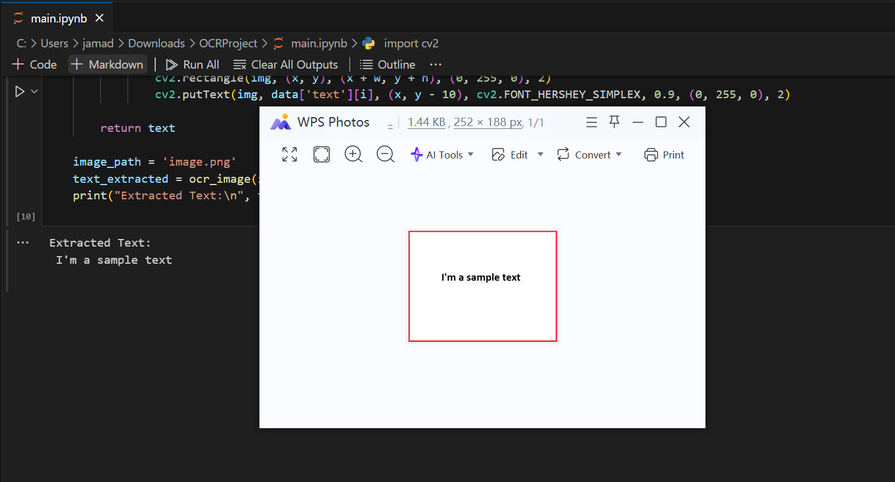

# 🖼️ OCR Text Extraction with Tesseract and OpenCV

This project demonstrates how to perform **Optical Character Recognition (OCR)** on images using Python, OpenCV, and Tesseract OCR. The script converts the input image to grayscale, applies binarization, and then extracts text from the image using Tesseract. It also highlights recognized text by drawing bounding boxes around detected words. 📜✨

## 📋 Requirements

- Python 3.x 🐍
- OpenCV (`opencv-python`) 🖥️
- Tesseract OCR 📥
- Pytesseract (`pytesseract`) 📦

## 📦 Dependencies Installation

You can install the necessary dependencies using the following commands:

```bash
pip install opencv-python pytesseract

```
For Linux systems, you also need to install Tesseract OCR:
```
sudo apt install tesseract-ocr
sudo apt install libtesseract-dev
sudo apt install tesseract-ocr-eng
```
📂 Project Structure
```
├── main.py           # 🐍 Python script to perform OCR on images
├── images.png        # 🖼️ Sample image for OCR
└── README.md         # 📖 Documentation
```
⚙️ Usage
1.Set the path to the Tesseract executable (Linux): 
The script expects the Tesseract executable to be located at
```
/usr/bin/tesseract.
```
 If it's installed elsewhere, you need to update the path in the code:
```
python
pytesseract.pytesseract.tesseract_cmd = r'/usr/bin/tesseract'

```
Run the script: Place your input image (images.png or any other image) in the project directory and execute the main.py script:
```
bash
python main.py
```
## 🔍 What the Script Does

1. **Load the image.** 🖼️
2. **Convert it to grayscale and binarize it.** ⚪⚫
3. **Perform OCR to extract text from the image.** 📜
4. **Draw bounding boxes around recognized text with high confidence (confidence score > 60).** 🟩✏️

## 📊 Example Output

After running the script, it will output the extracted text:
```
Extracted Text:
Sample Text from Image
```
Additionally, the image with bounding boxes around detected text will be displayed. 🖼️✅
