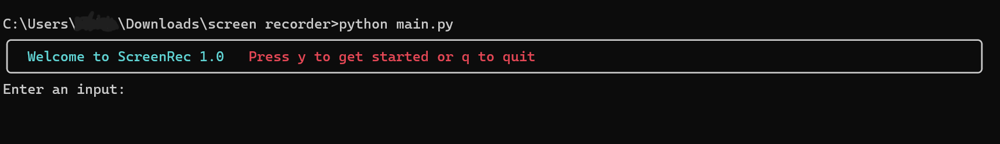
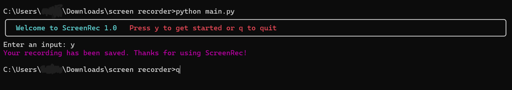

## ScreenRec ##

Don't pay for an essential functionality, screen record to your heart's content with ScreenRec - a CLI tool with a pretty cool interface and you need only 2 options to navigate the tool - a 'q' to quit and a 'y' to start.

ScreenRec has a GUI for easy access for non-technical users.

### How do I use it? ###

open up your terminal

git clone https://github.com/srii5477/Screen-Recorder

cd over to the Screen-Recorder folder

and pip install -r requirements.txt

finally run python main.py

that's all you need to do.

