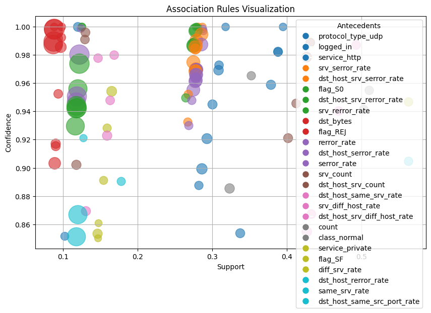

# Intrusion Detection System Using Apriori and Association Rule Mining

## AIM
To develop an effective intrusion detection system that identifies and classifies anomalies in network traffic using Apriori and association rule mining techniques.

## DATASET LINK
- [Intrusion Detection System Dataset](./Dataset/Train_data.csv)  <!-- Replace with your actual dataset link -->

## MY NOTEBOOK LINK
- [Intrusion Detection System Notebook](./network-intrusion-detection-using-ARM.ipynb)  <!-- Replace with your actual notebook link -->

## DESCRIPTION
This project aims to build an intrusion detection system (IDS) leveraging the power of Apriori algorithm and association rule mining to analyze network traffic data. 

- **Requirement**: The project is required to detect unusual patterns in network traffic that may indicate malicious activity or security breaches.
- **Necessity**: In today’s digital age, cybersecurity is crucial to protect sensitive data and maintain trust in technology infrastructures.
- **Benefits**: This IDS can help organizations quickly identify and respond to potential threats, thereby enhancing security measures.
- **Approach**: I started by exploring existing datasets, followed by a detailed analysis of features relevant to network traffic and potential intrusions. 
- **Resources Used**: I referred to the book "Data Mining: Concepts and Techniques" by Jiawei Han and Micheline Kamber (Pages 245-280), along with various research papers on intrusion detection systems.

## EXPLANATION

### DETAILS OF THE DIFFERENT FEATURES
- **duration**: Duration of the connection in seconds; can indicate the persistence of connections.
- **src_bytes**: Number of bytes sent from the source; high values may suggest large data transfers.
- **dst_bytes**: Number of bytes sent to the destination; similarly, high values can indicate substantial outgoing data.
- **land**: A binary feature indicating whether the source and destination IP addresses are the same; may suggest suspicious behavior.
- **wrong_fragment**: Number of wrong fragments; an indicator of possible packet fragmentation issues or attacks.
- **urgent**: Number of urgent packets; high counts may signify a potential attack strategy.
- **hot**: Number of "hot" indicators; can indicate frequent access to certain services, possibly leading to vulnerabilities.
- **num_failed_logins**: Count of failed login attempts; a high value can indicate brute-force attack attempts.
- **logged_in**: A binary feature indicating whether the user is logged in; essential for determining user activity.
- **num_compromised**: Number of compromised conditions observed; helps in assessing the security of the connection.
- **root_shell**: Indicates whether a root shell was obtained; a critical indicator of privilege escalation.
- **su_attempted**: Number of times a superuser (root) account access was attempted; may indicate unauthorized access attempts.
- **num_root**: Count of root accesses; essential for assessing potential breaches.
- **num_file_creations**: Number of file creation attempts; can indicate unusual behavior, especially in a user context.
- **num_shells**: Number of shell accesses; can indicate multiple command executions that may be part of an attack.
- **num_access_files**: Count of file accesses; frequent accesses might suggest data exfiltration or unauthorized access.
- **num_outbound_cmds**: Number of outbound commands; can indicate malicious activities or command execution on remote systems.
- **is_host_login**: Indicates whether the login is from a host; useful for differentiating between local and remote logins.
- **is_guest_login**: Indicates whether the login is from a guest user; can help identify unauthorized access attempts.
- **count**: Total number of connections to the same host; helps in analyzing connection patterns.
- **srv_count**: Number of connections to the same service; assists in identifying common services being targeted.
- **serror_rate**: Rate of connection requests that resulted in a "service unavailable" error; higher rates may indicate issues.
- **srv_serror_rate**: Rate of service errors; helps in understanding the reliability of the service.
- **rerror_rate**: Rate of connection requests that resulted in a "connection refused" error; can indicate network issues or attacks.
- **srv_rerror_rate**: Rate of service connection refusals; provides insights into potential denial-of-service scenarios.
- **same_srv_rate**: Rate of connections to the same service; higher rates might indicate unusual behavior or patterns.
- **diff_srv_rate**: Rate of connections to different services; helps in understanding the diversity of services accessed.
- **srv_diff_host_rate**: Rate of connections to different hosts for the same service; can reveal spread or targeting strategies.
- **dst_host_count**: Total connections to the destination host; provides an overview of traffic directed at a specific host.
- **dst_host_srv_count**: Number of connections to the same service on the destination host; helps identify service-specific attacks.
- **dst_host_same_srv_rate**: Rate of connections to the same service on the destination host; can indicate service targeting.
- **dst_host_diff_srv_rate**: Rate of connections to different services on the destination host; helps in assessing service access diversity.
- **dst_host_same_src_port_rate**: Rate of connections from the same source port to the destination host; may suggest persistence or targeted attacks.
- **dst_host_srv_diff_host_rate**: Rate of connections to different hosts for the same service on the destination; helps identify distributed access.
- **dst_host_serror_rate**: Rate of service errors for the destination host; higher rates might indicate issues affecting access.
- **dst_host_srv_serror_rate**: Rate of service connection refusals for the destination; useful for identifying denial-of-service scenarios.
- **dst_host_rerror_rate**: Rate of connection refusals for the destination host; can help identify network attacks.
- **dst_host_srv_rerror_rate**: Rate of service connection refusals for the destination host; aids in understanding overall service reliability.
- **class_anomaly**: This feature classifies whether the data point represents normal behavior or an anomaly.

### WHAT I HAVE DONE
1. Step 1: Conducted initial data exploration and understanding.
2. Step 2: Performed data cleaning and preprocessing to handle missing values and noise.
3. Step 3: Engineered features and selected relevant ones for analysis.
4. Step 4: Implemented the Apriori algorithm for mining frequent itemsets.
5. Step 5: Evaluated and fine-tuned the association rules based on metrics like confidence and lift.
6. Step 6: Validated the model using a test dataset to assess its effectiveness.

### PROJECT TRADE-OFFS AND SOLUTIONS
1. **Trade-off 1**: Balancing model accuracy with computational efficiency when mining large datasets.
   - **Solution**: Optimized the parameters of the Apriori algorithm to reduce computation time while maintaining acceptable accuracy.
2. **Trade-off 2**: Model complexity vs. interpretability of the results.
   - **Solution**: Chose a simpler model that provided understandable results while still effectively identifying anomalies.

### LIBRARIES NEEDED
- pandas
- numpy
- scikit-learn
- matplotlib
- seaborn
- mlxtend (for Apriori and association rules)

### SCREENSHOTS
- 

### MODELS USED AND THEIR ACCURACIES
| Model       | Precision |Recall |
|-------------|----------|------|
| Apriori     | 82%     | 79% |

## CONCLUSION

### WHAT YOU HAVE LEARNED
- Gained insights into network traffic analysis and anomaly detection.
- Improved understanding of association rule mining and its application in cybersecurity.
- Faced challenges such as data preprocessing and parameter tuning, which were resolved through iterative testing.

### USE CASES OF THIS MODEL
1. **Application 1**: Real-time monitoring of network traffic for enterprise-level security.
2. **Application 2**: Enhancing security protocols for IoT devices to prevent unauthorized access.

### HOW TO INTEGRATE THIS MODEL IN REAL WORLD
1. Prepare the data pipeline for real-time traffic analysis.
2. Deploy the model using tools like Flask or Docker for integration with existing systems.
3. Monitor and maintain the model, ensuring it adapts to new types of threats.

### FEATURES PLANNED BUT NOT IMPLEMENTED
- **Feature 1**: Integration of machine learning classifiers to improve prediction accuracy, which was constrained by time and resource availability.
- **Feature 2**: A user-friendly dashboard for visualizing detected anomalies, which could not be implemented due to lack of front-end development experience.

### SIGNATURE

*Vivek Prakash*

[LinkedIn](https://www.linkedin.com/in/vivek-prakash-b46830283/)  

