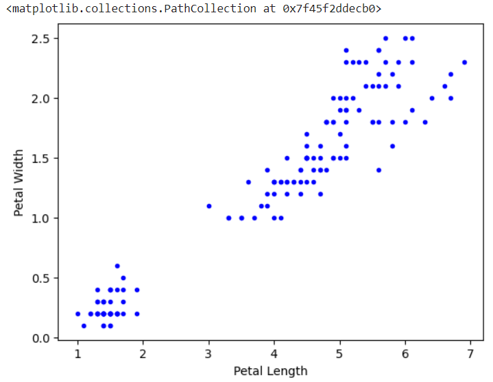

# Results for Iris Dataset Classification Using K-Nearest Neighbors (KNN)

In this section, we present the results of applying the K-Nearest Neighbors (KNN) algorithm on the Iris dataset. The following visualizations help us understand how well the model performs and how the data is distributed.

---

## 1. Scatter Plot of All Data Points

The first plot shows all the data points in the Iris dataset with the following features:
- **Sepal Length**
- **Sepal Width**

---

## 2. Category-wise Scatter Plots

Each point is color-coded according to its species (Setosa, Versicolor, Virginica).

---

## 3. Decision Boundary Plot

The following plot shows the decision boundaries created by the KNN algorithm. This helps us visualize the regions where the algorithm classifies a new data point into a specific class.

---

## Summary of Results

- The **scatter plots** show a clear separation between the species, especially between Setosa and the other two classes.
- The **decision boundary plot** shows how the KNN algorithm divides the feature space into different regions based on the nearest neighbors.

By tuning the value of **K**, we can adjust the smoothness of the decision boundaries. In this example, we used `K=5`, which provides a good balance between underfitting and overfitting.

