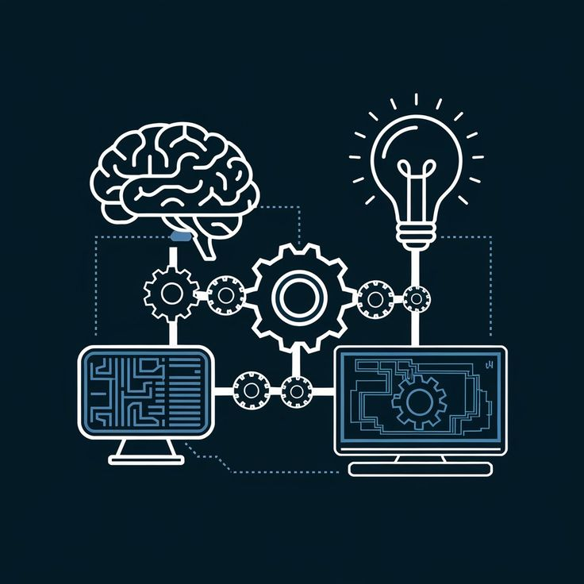
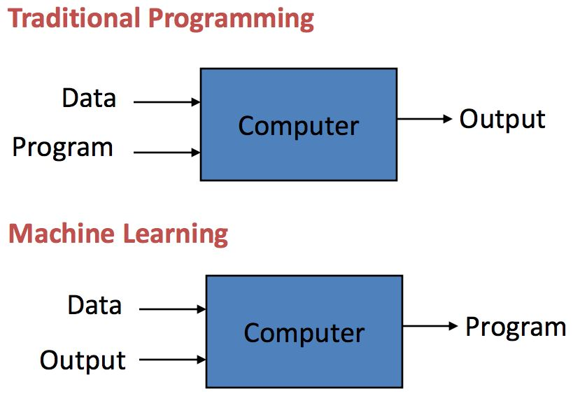

# Beginner's Guide to Machine Learning

## About Machine Learning

Machine Learning is a subset of Artificial Intelligence (AI), focused on making computers and machines imitate the way humans learn  for them to perform any task autonomously, without having any human intervention through experience and exposure to more data. 

The learning of a machine learning can be broken down into three major steps which are as follows:
1. **Decision Process**: A machine learning model makes predictions based on the patterns found in the input data.
2. **Error Function**: The predictions are checked against a set of known examples.
3. **Model Optimization Process**: If the model can fit better to the data points in the training set, then weights are adjusted to reduce the discrepancy between the known example and the model estimate. This is repeated to increase the accuracy. 

## Machine Learning vs. Traditional Programming

Let's see how machine learning differs from traditional programming techniques.

### ➡️ Traditional Programming

**How It Works**

- Input: Usually structured and predictable data
- Process: Human-written rules and logic
- Output: Deterministic result (same input always yields the same output)

**Characteristics**

- Rule-Based Logic: The programmer defines every condition and outcome.
- Deterministic Output: The same input always produces the same result.
- Manual Updates: Any change in requirements or data format requires manual code changes.
- Transparency: The logic is clear, traceable, and easy to debug.
- Limited Flexibility: Struggles with complex or unpredictable scenarios.
- Best For: Well-defined, stable problems (e.g., payroll, calculators, sorting, transaction processing).

**Example**

A spam filter built with traditional programming might use a list of banned words. The programmer writes rules: "If an email contains 'win money', mark as spam." Every new spam pattern requires a new rule.

### ➡️ Machine Learning

**How It Works**

- Input: Large, often unstructured datasets (images, text, sensor data)
- Process: The algorithm learns from data during training, building a model that captures relationships
- Output: Probabilistic predictions or classifications (output may vary with new data)

**Characteristics**

- Data-Driven Learning: The model learns patterns from examples, not from explicit rules.
- Probabilistic Output: Results are predictions with associated probabilities, not fixed answers.
- Adaptability: The system can improve and adapt as new data arrives, often without manual intervention.
- Opacity: Complex models (like deep neural networks) can be difficult to interpret ("black box").
- Best For: Complex, data-rich problems where explicit rules are hard to define (e.g., image recognition, language translation, fraud detection).

**Example**

A spam filter built with machine learning is trained on thousands of emails labeled as "spam" or "not spam." The model learns patterns in the data and can identify new spam emails even if they don’t match any pre-written rule.

## Types of ML Systems 

There are mainly 4 types of machine learning systems which are follows:

### Supervised Learning

It is a type of machine learning where a model is trained on labeled data, meaning each input is paired with the correct output.

### Unsupervised Learning

It is a type of machine learning technique in which an algorithm discovers patterns and relationships using unlabeled data. Unlike supervised learning, unsupervised learning doesn't involve providing the algorithm with labeled target outputs. The primary goal of Unsupervised learning is often to discover hidden patterns, similarities, or clusters within the data, which can then be used for various purposes, such as data exploration, visualization, dimensionality reduction, and more.

### Semi-Supervised Learning

It is a machine learning algorithm that works between the supervised and unsupervised learning so it uses both labelled and unlabelled data.

### Reinforcement Learning

It is a learning method that interacts with the environment by producing actions and discovering errors. Trial, error, and delay are the most relevant characteristics of reinforcement learning. In this technique, the model keeps on increasing its performance using Reward Feedback to learn the behavior or pattern. 

## Machine Learning Challenges

1. **Poor Quality of Data**: Data plays a significant role in the machine learning process. One of the significant issues that machine learning professionals face is the absence of good quality data. Unclean and noisy data can make the whole process extremely complex.

2. **Underfitting of Training Data**: This process occurs when data is unable to establish an accurate relationship between input and output variables. It signifies the data is too simple to establish a precise relationship. To overcome this issue:

    - Maximize the training time
    - Enhance the complexity of the model
    - Add more features to the data
    - Reduce regular parameters
    - Increasing the training time of model

3. **Overfitting of Training Data**: Overfitting refers to a machine learning model trained with a massive amount of data that negatively affect its performance. This means that the algorithm is trained with noisy and biased data, which will affect its overall performance. We can tackle this issue by:

    - Analyzing the data with the utmost level of perfection
    - Use data augmentation technique
    - Remove outliers in the training set
    - Select a model with lesser features

4. **Slow Implementations**: The machine learning models are highly efficient in providing accurate results, but it takes a tremendous amount of time. 

5. **Need of skilled professionals**: Machine learning is all set to bring a big transformation in technology. It is one of the most rapidly growing technologies used in medical diagnosis, speech recognition, robotic training, product recommendations, video surveillance, and this list goes on. Therefore it is necessary for people to be more skilled in this regard for them to work efficiently. 

## Tuning 

Hyperparameter tuning is the process of selecting the optimal values for a machine learning model's hyperparameters. These are typically set before the actual training process begins and control aspects of the learning process itself. They influence the model's performance its complexity and how fast it learns.

**Advantages**

1. Improved Model Performance
2. Reduced Overfitting and Underfitting
3. Enhanced Model Generalizability

**Disadvantages**

1. Developing Adaptive Hyperparameter Tuning Methods
2. Dealing with High-Dimensional Hyperparameter Spaces
3. Incorporating Domain Expertise 

---

🌟 Keep Learning!
