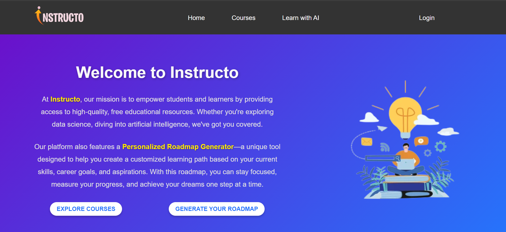
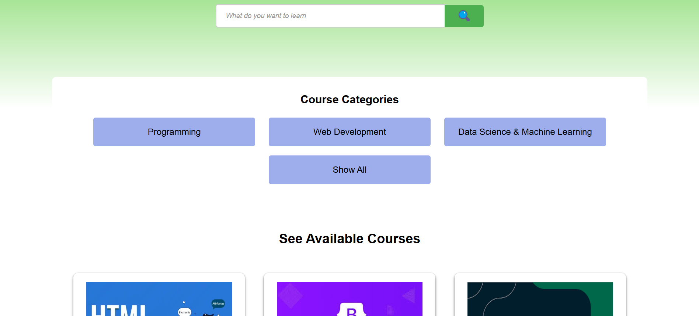

# Instructo - AI-Powered Personalized Learning Platform

**Instructo** is an **AI-driven educational platform** designed to enhance learning by generating **personalized roadmaps** and providing access to structured study materials. The platform focuses on **advanced computer science topics**, eliminating unnecessary concepts for an optimized learning experience.

---

## 🚀 Features

- 🎯 **AI-Powered Personalized Roadmap Generator** – Get customized learning paths based on your skills and goals.
- 📚 **Multi-Language Support** – Access courses in various languages for a better understanding. 
- 🚀 **Optimized UI** – A clean and intuitive design for seamless navigation.
- 🔍 **Search & Filter** – Easily find the right topics and resources.

---

## 📸 Overview

### 🔹 **Home Page**



### 🔹 **Personalized Roadmap**


### 🔹 **Courses**



### 🔹 **Course page**


---

## 🛠 Installation

1. Clone the repository:

   ```bash
   git clone https://github.com/yourusername/instructo.git
   cd instructo
   ```

2. Install dependencies:

   ```bash
   npm install
   ```

3. Start the application:

   ```bash
   npm start
   ```

---

## 💡 Contributing

**Contributions are welcome! Feel free to submit issues and pull requests.**

---
