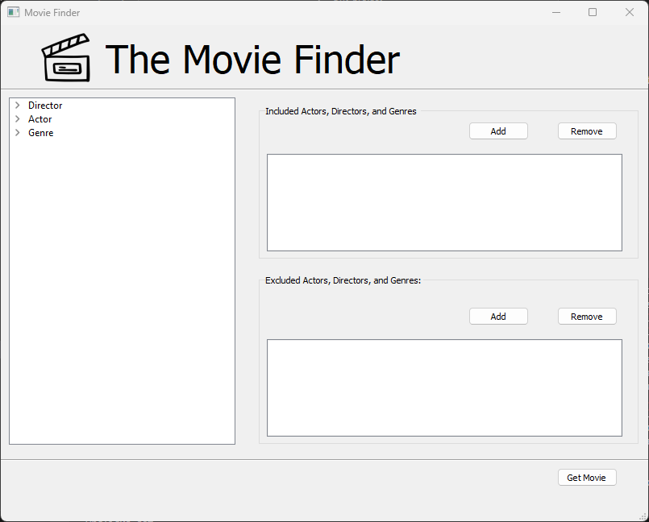
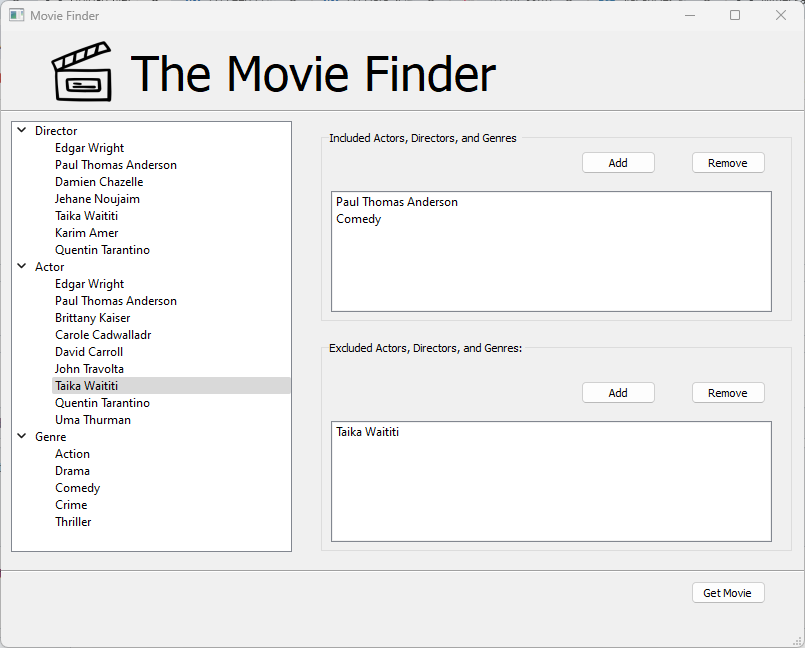
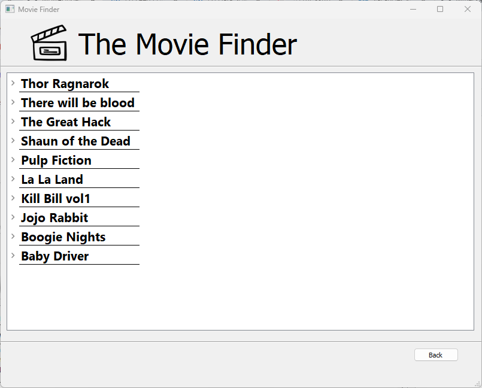
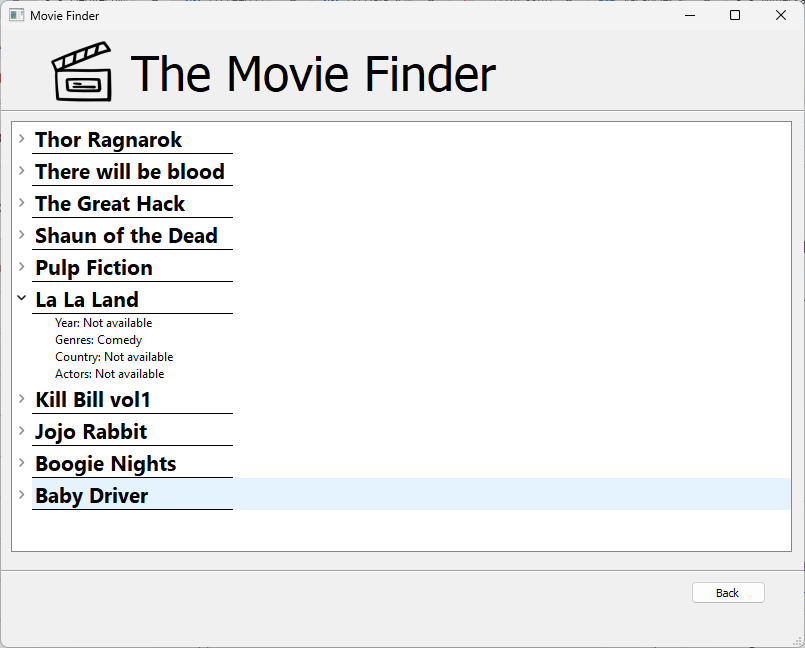
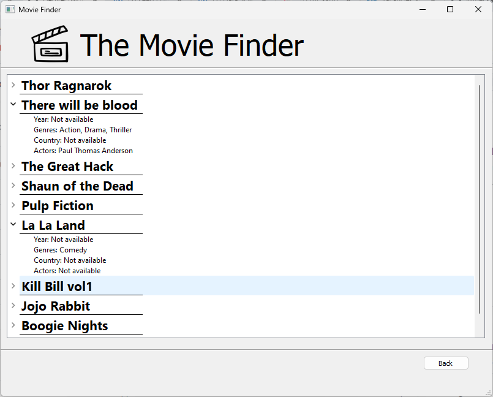

# Movie Recommendation
A python application that returns you a list of films based on the included/excluded actors, directors and genres.

## Libraries Needed
-owlready2

```bash
pip install owlready2
```
-pyqt5

```bash
pip install pyqt5
```
## How to run
Open the project folder and run pythonApplication.py
```bash
python pythonApplication.py
```
## Screenshots of Application
### Main Window




You can manage directors, actors, and genres within the tree by adding or removing them from the included and excluded sections. Once you've configured your preferences, simply press the "Get Movie" button to fetch movies that match your criteria. This action will take you to the Information Window where you can view detailed information about the selected movie.

### Information Display Window






