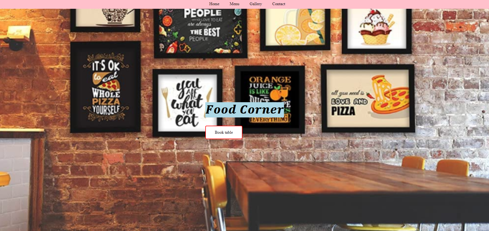

# Restaurant Website

This repository contains the source code for a simple restaurant website.

## Features

- Navigation menu with smooth scrolling
- Menu display with images and prices
- Gallery showcasing restaurant images
- Contact information and booking form

## Usage

To use this website, simply clone the repository and open the `index.html` file in your web browser.

## To run this code

- To use run this code install XAMPP in your pc.
- Now clone this repository in your local storage c drive ->folder name htdocs.
- Now create a table in you mysql PHP admin and create a table .
- Now replace the local host,username,password,database name with the credentials in the php code.
- Now open your chrome and in search bar type "localhost/restaurantwebsite-main".
- You can see the out put.

## Demo

👉 <a href="https://saipradyumnagoud.github.io/Restaurantwebsite/" target="_blank" >demo</a>
